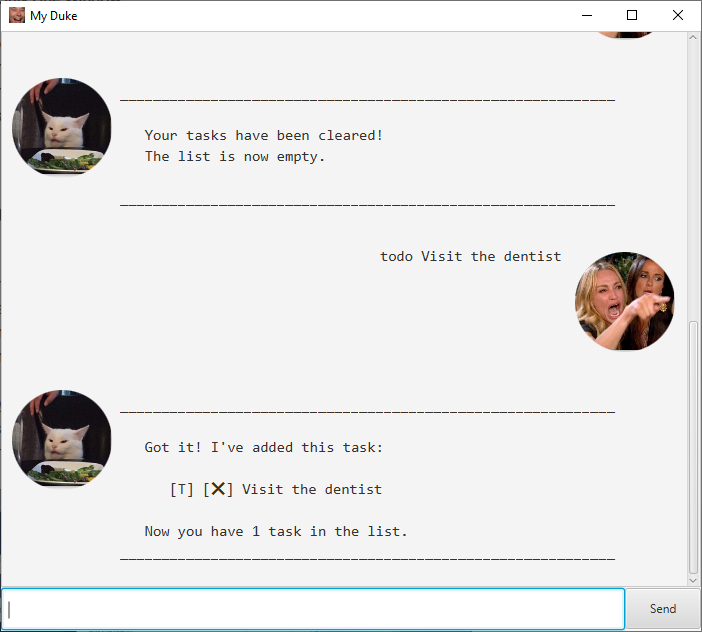
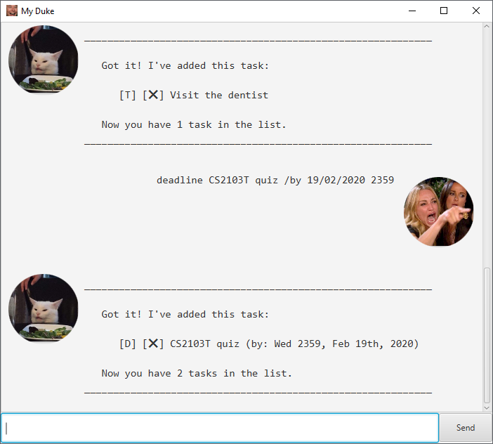
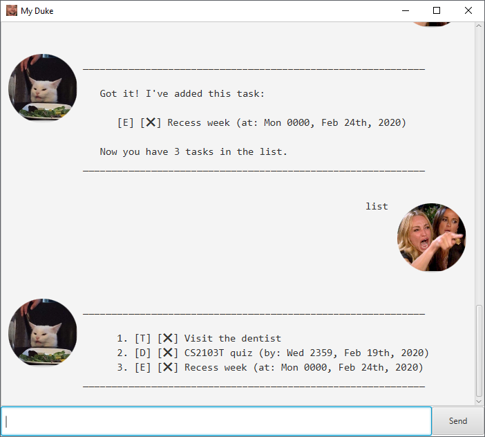
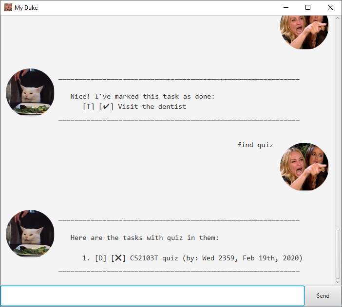

# User Guide
Welcome to Duke, your personal assistant!

# Features 
## Feature 1: `todo <description>`
Adds a task with a description to Duke, and stores it in Duke.

### Example of usage: 
`todo Visit the dentist`

### Expected outcome:

## Feature 2: `deadline <description> /by <dd/mm/yyyy hhmm>`
Adds a task with a description and a deadline to Duke, and stores it in Duke.

### Example of usage: 
`deadline CS2103T quiz /by 19/02/2020 2359`

### Expected outcome:

## Feature 3: `event <description> /at <dd/mm/yyyy hhmm>`
Adds a task with a description and a date to Duke, and stores it in Duke.

### Example of usage: 
`event Recess week /at 24/02/2020 0000`

### Expected outcome:

## Feature 4: `list`
Shows all the lists stored in Duke currently.

### Example of usage: 
`list`

### Expected outcome:

## Feature 5: `clear`
Clears the list of tasks.

### Example of usage: 
`clear`

### Expected outcome:

## Feature 1: `todo <description>`
Adds a task with a description to Duke, and stores it in Duke.

### Example of usage: 
`todo Visit the dentist`

### Expected outcome:

## Feature 6: `find <keywords>`
Finds all the tasks that contain `<keywords>` in them.

### Example of usage: 
`find quiz`

### Expected outcome:

## Feature 7: `schedule <dd/mm/yyyy>`
Gets the schedule for a day.

### Example of usage: 
`schedule 19/02/2020`

### Expected outcome:

## Feature 8 `save
Saves the current list of tasks.

### Example of usage: 
`save`

### Expected outcome:

## Feature 9 `bye`
Ends Duke, and saves the current list of tasks, which can be 
### Example of usage: 
`bye`

### Expected outcome:

